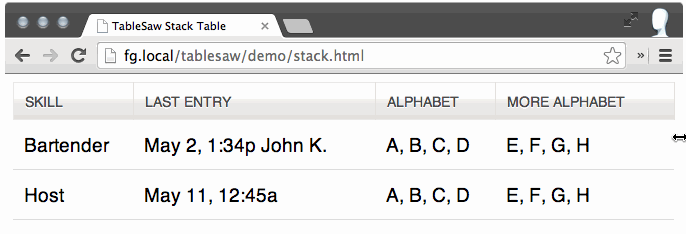
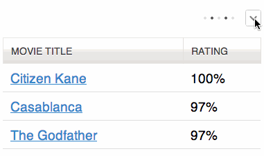
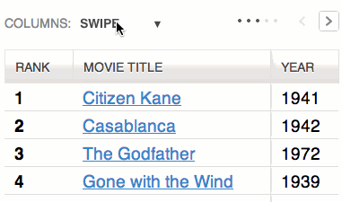

# Tablesaw

A set of plugins for responsive tables.

## Table Modes

### Stack

The Stack Table stacks the table headers to a two column layout with headers on the left when the viewport width is less than `40em` (`640px`).

    <table data-mode="stack">



* [Stack Table Demo](http://filamentgroup.github.io/tablesaw/demo/stack.html)

If you only want to use the Stack Table and don’t want all the extra features below (save yourself some bytes), Tablesaw provides a Stack-Only version.

* [Stack-Only Table Demo](http://filamentgroup.github.io/tablesaw/demo/stackonly.html)

### Toggle

The Column Toggle Table allows the user to select which columns they want to be visible.

    <table data-mode="columntoggle">

Table headers must have a `data-priority` attribute to be eligible to toggle. `data-priority` is a numeric value from 1 to 6, which determine default breakpoints at which a column will show. As of first release, the defaults are:

    <th data-priority="persist"><!-- Not eligible for toggle, always shows --></th>
    <th data-priority="1"><!-- Shows at (min-width: 20em) (320px) --></th>
    <th data-priority="2"><!-- Shows at (min-width: 30em) (480px) --></th>
    <th data-priority="3"><!-- Shows at (min-width: 40em) (640px) --></th>
    <th data-priority="4"><!-- Shows at (min-width: 50em) (800px) --></th>
    <th data-priority="5"><!-- Shows at (min-width: 60em) (960px) --></th>
    <th data-priority="6"><!-- Shows at (min-width: 70em) (1120px) --></th>

#### Add a Mini Map

    <table data-mode="columntoggle" data-minimap>




* [Column Toggle Demo](http://filamentgroup.github.io/tablesaw/demo/toggle.html)

### Swipe

Allows the user to use the swipe gesture (or use the left and right buttons) to navigate the columns.

    <table data-mode="swipe">

Columns also respect the `data-priority="persist"` attribute.

    <th data-priority="persist"><!-- Always shows --></th>

#### Add a Mini Map

    <table data-mode="swipe" data-minimap>


* [Swipe Demo](http://filamentgroup.github.io/tablesaw/demo/swipe.html)

## Mini Map

Use `data-minimap` to add a series of small dots to show which columns are currently visible and which are hidden. Only available on `swipe` and `columntoggle` tables. Examples available above.

## Mode Switcher

    <table data-mode-switch>

    <!-- With a different default mode -->
    <table data-mode="swipe" data-mode-switch>

    <!-- Exclude a mode from the switcher -->
    <table data-mode-switch data-mode-exclude="columntoggle">



* [Mode Switcher Demo](http://filamentgroup.github.io/tablesaw/demo/modeswitch.html)

## Sortable

Allows sorting on columns.

    <table data-sortable>
        <thead>
            <tr>
                <!-- Default column -->
                <th data-sortable-col data-sortable-default-col>Rank</th>
                <th data-sortable-col>Movie Title</th>
                <th data-sortable-col>Year</th>
                <th data-sortable-col><abbr title="Rotten Tomato Rating">Rating</abbr></th>
                <!-- Unsortable column -->
                <th>Reviews</th>
            </tr>
        </thead>
        ...

Use `data-sortable-switch` to add a form element to choose the sort order.

    <table data-sortable data-sortable-switch>

* [Sortable Demo](http://filamentgroup.github.io/tablesaw/demo/sort.html)

## Kitchen ~~Table~~ Sink

All of the above options combined into a single table.

* [Kitchen Sink Demo](http://filamentgroup.github.io/tablesaw/demo/kitchensink.html)

## Getting Started

TableSaw requires [Respond.js](https://github.com/scottjehl/Respond) for IE8- support.

### Using Stack-Only TableSaw

As shown above, we provide a Stack-mode-only package of TableSaw. It’s a barebones version that doesn’t include any of the other features above.

```html
<link rel="stylesheet" href="tablesaw.css">
<!--[if lt IE 9]><script src="respond.min.js"></script><!--<![endif]-->
<script src="tablesaw.js"></script>
```

And then:

```html
<table class="tablesaw" data-mode="stack">
```

Check out [the Stack-Only demo](http://filamentgroup.github.io/tablesaw/demo/stackonly.html) to see a working example.

### The Full TableSaw 

If you want the other modes, it’ll take a little bit more configuration.

The `columntoggle` mode requires the [Filament Group dialog](https://github.com/filamentgroup/dialog). Install all dependencies easily using bower:

    `bower install`

(if bower is installed globally) or

    `./node_modules/.bin/bower install`

(if bower is not installed globally)

```html
<link rel="stylesheet" href="bower_components/filament-dialog/dialog.css">
<link rel="stylesheet" href="tablesaw.css">

<!--[if lt IE 9]><script src="respond.min.js"></script><!--<![endif]-->
<script src="bower_components/jquery/jquery.js"></script>
<script src="bower_components/filament-dialog/dialog.js"></script>
<script src="tablesaw.js"></script>
```

Next include the tablesaw icons in `src/icons` with your grunticon build and include the grunticon loader.

Check out any of the demos above for complete working examples.

## TODO

* Generate a zip file that can be downloaded (includes full sources, icons)
* Add to bower
* Add VanillaJS/non-jQuery version
